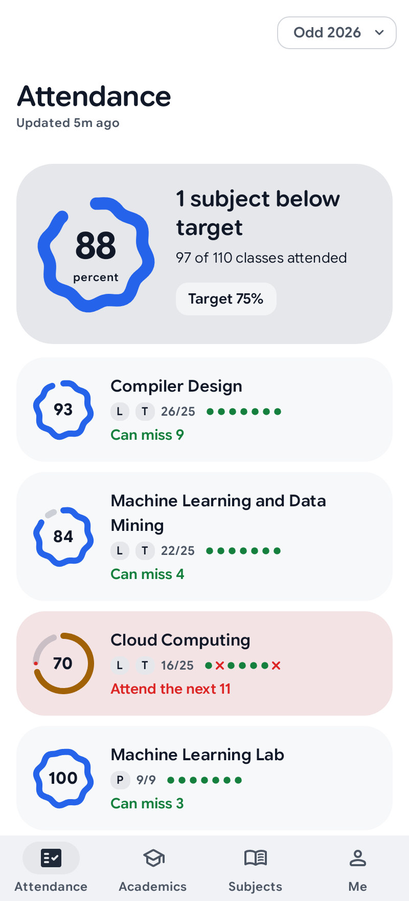
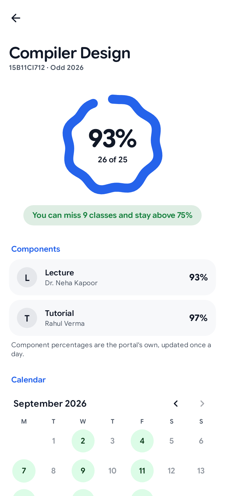
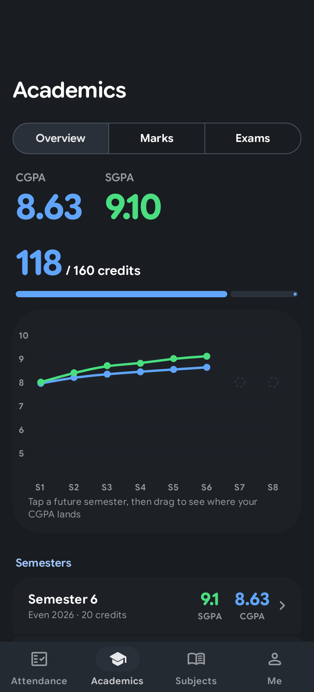
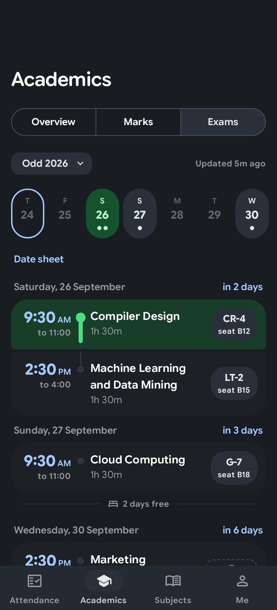

# JPortal for Android

The JIIT webportal, as an app. A native Kotlin and Jetpack Compose remake of [JPortal](https://github.com/codeblech/jportal), rebuilt after the portal moved students to Google sign-in.

Unofficial. Not affiliated with or endorsed by JIIT.

## What's in it

<p align="center">
  
  
  
  
</p>

- attendance, counted class by class
- how many classes you can skip, or need to attend (the actual reason you are here)
- exam schedule with rooms, seats and a countdown (nobody asked for the countdown)
- SGPA, CGPA, grade cards and marks (viewer discretion advised)
- a CGPA what-if for the semesters to come (hope is free)
- works offline (unlike the portal, which barely works online)

## Install

[](https://apps.obtainium.imranr.dev/redirect?r=obtainium://add/https://github.com/codelif/jportal-android)
[](https://github.com/codelif/jportal-android/releases/latest)

Every release is built by CI from a signed tag, and the APK ships with a SHA-256 checksum.

**F-Droid**: coming.

**Play Store**: coming.

## Building

Needs JDK 21 or newer and the Android SDK (compileSdk 37).

```sh
git clone --recurse-submodules https://github.com/codelif/jportal-android
cd jportal-android
./gradlew :app:assembleGithubDebug
```

The portal client is [ktjiit](https://github.com/codelif/ktjiit), pulled in as a submodule and an included build.

There are two flavors: `github` (can check GitHub for updates, once that is switched on in settings) and `play` (can't). F-Droid ships the `github` one.

## Privacy

Your portal session is sealed with an Android Keystore key and never leaves the phone except to talk to the portal. No analytics and no crash reporting. The "copy debug report" button under About is the only diagnostics, and it strips tokens, names and ids. The full policy is in [PRIVACY.md](PRIVACY.md).

## Credits

Big 🍆 Energy lives on in [Yash Malik](https://github.com/codeblech): [JPortal](https://github.com/codeblech/jportal) gave this app its design and its spirit, and its hand-drawn icon lives on as the YR Special in settings. Protocol groundwork from [jsjiit](https://github.com/codeblech/jsjiit) and [pyjiit](https://github.com/codelif/pyjiit). See NOTICE.

## License

GPL-3.0-only
